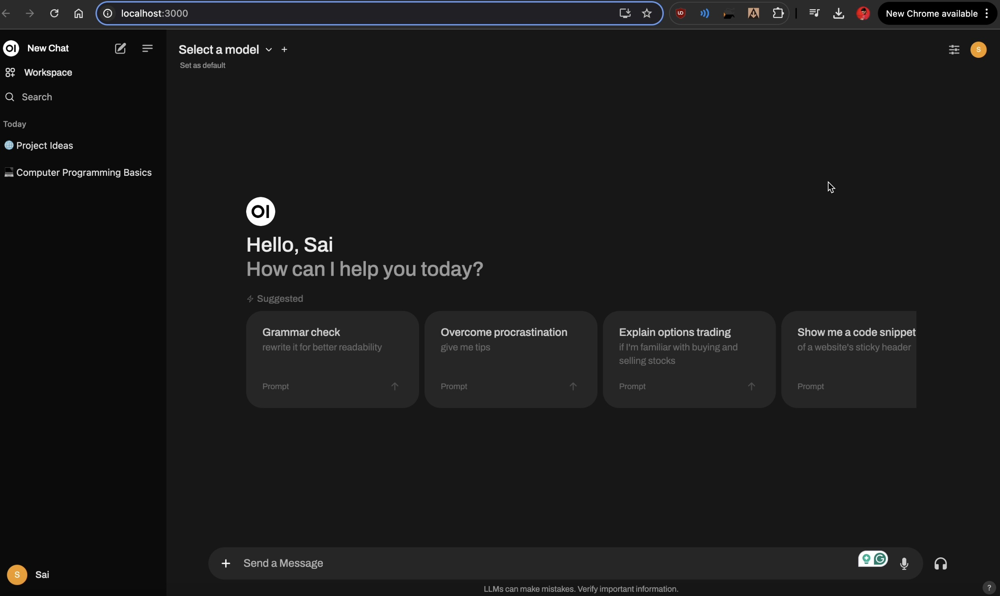
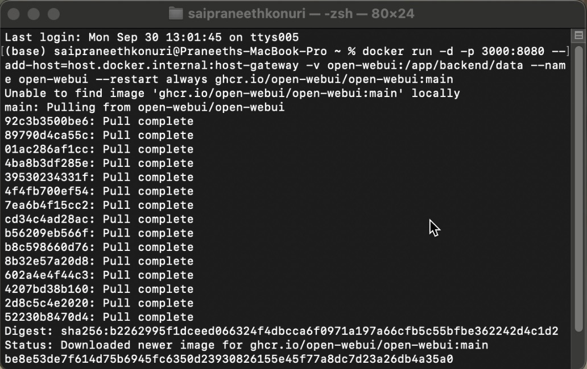
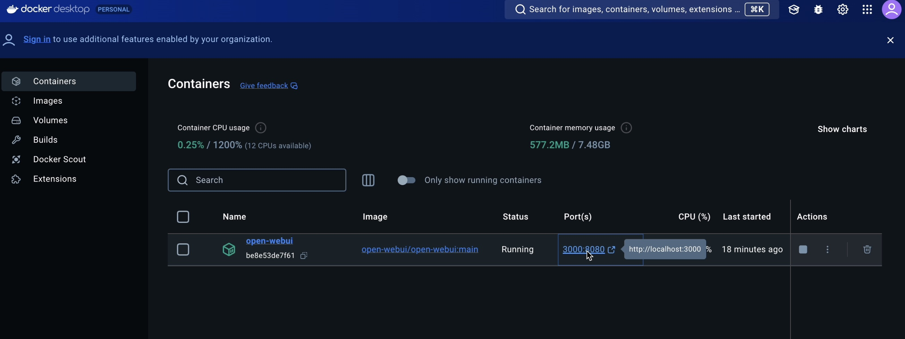
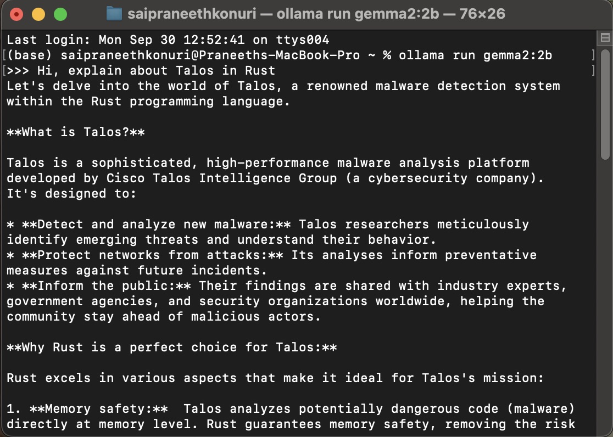
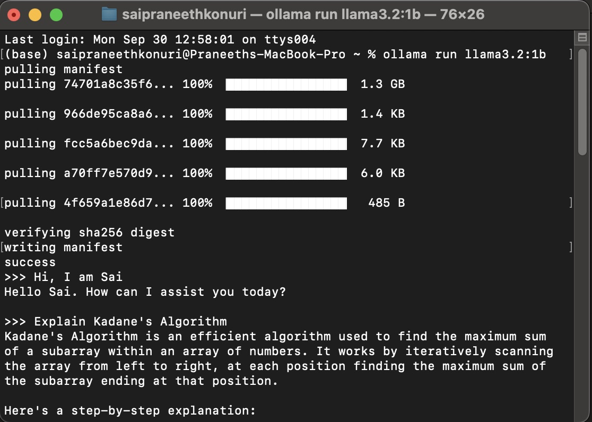
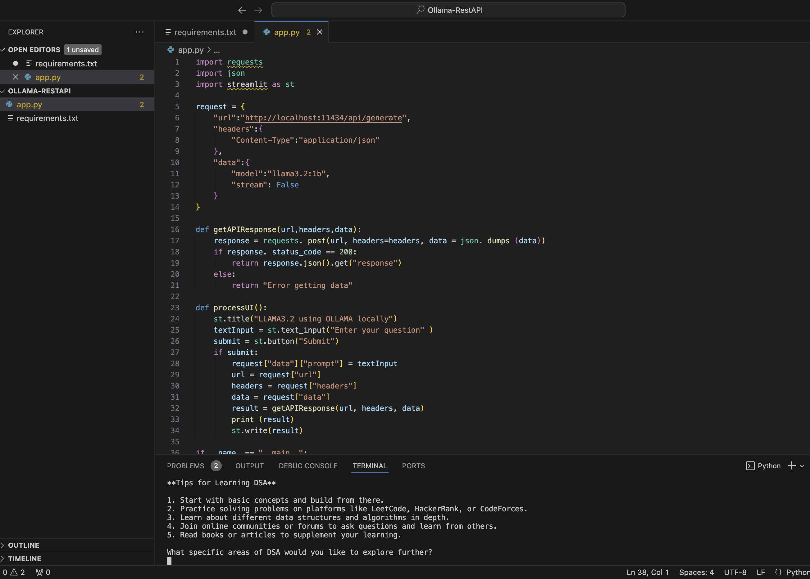
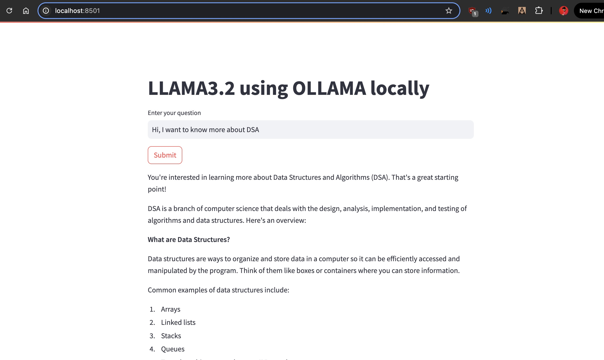

## Contents

1. [OpenWebUI Setup](#openwebui-setup)
2. [Docker Configuration](#docker-configuration)
3. [Ollama Models](#ollama-models)
4. [Multimodal Demonstration](#multimodal-demonstration)
5. [RestAPI](#restapi-call)

## OpenWebUI Setup

OpenWebUI provides a user-friendly interface for interacting with Ollama models.

## Docker Configuration

We use Docker to containerize our Ollama setup, ensuring consistent environments across different systems.

### Docker OpenWebUI

### Docker Port Configuration

## Ollama Models

### Gemma 2B Demo

Here's a demonstration of the Gemma 2B model running on Ollama:

## Multimodal Demonstration

This section showcases Ollama's ability to process and generate insights from both text and images:

## RestAPI

